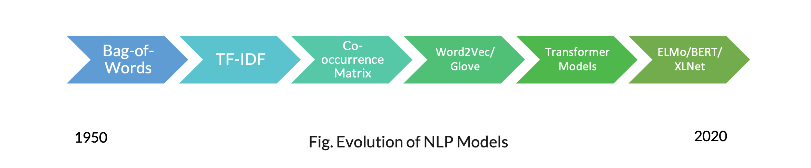
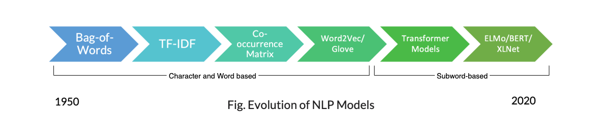

<!-- _class: invert -->

# Text tokenizers for NLP

Bauke Brenninkmeijer

<!--  -->

<!-- footer: DSFC 2022 -->

---

<!-- footer: DSFC 2022 • **Text Tokenizers for NLP** • Bauke Brenninkmeijer-->

---
<!-- paginate: true -->

# Goal

Showcase the silent revolution of text tokenizers

---

## whois:`Bauke Brenninkmeijer`

- MSc in CS and Data Science @Nijmegen
- Data Scientist @ABNAMRO since 2019
  - 1.5 years in Data Management
  - ~1 years in Global Markets
- Co-founder of DSFC

-  [@baukebrenninkmeijer](https://github.com/Baukebrenninkmeijer)

---

# But why? What do you do with tokenizers?

During my work: nothing, unfortunately.

Outside of work: currently, also nothing.

**But** I'm a curious person. And I worked with NLP before but never really dove deep into tokenizers.

---

# Disclaimer

In an attempt to protect myself from looking foolish,
I will limit the scope of this talk to english.

Asian languages like Chinese often require different approaches of which I know nothing.

---

# Now I will bestow my knowledge upon thee

---

# Tokenization [1/2]

- Required for using text in any NLP techniques.
- Chops a text into smaller units called **`tokens`**.
- Tokens can represent many different things, such as
  - words
  - characters
  - parts of words

---

# Tokenization [2/2]

- Form the building blocks of any NLP model
- Tokens are mapped to an ID
- Models ingest these IDs, since they can only use numeric values.

---

# Definitions

- **Corpus**: Textual dataset
- **Token**: Part of a text, used as input for models.
- **ID**: an index (i.e. a unique integer) that maps to a token.

---

# Types of tokenizer

- word-based
`'tokenizer'`
- character based
`'t', 'o', 'k', 'e', 'n', 'i', 'z', 'e', 'r'`
- subword-based
`'token', 'izer'`

---

# NLP Evolution

Where are the tokenizers?

---

# NLP Evolution

---

# On to the interactive slides!

---

# My slides

- Created with [MARP](https://github.com/marp-team/marp) in Markdown
- Created with [RISE](https://rise.readthedocs.io/en/stable/) in jupyter notebook

Please find the slides on my github: https://github.com/Baukebrenninkmeijer/diving-into-nlp-encoders

---
<!-- _class: invert -->

# Questions?
